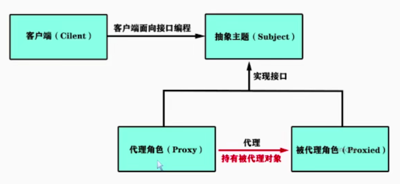

## 模板方法模式

模板涉及的方法种类
```
public abstract AbstractTemplate{

    //模板方法
	public void templateMethod(){
		concreateMethod();
		hookMethod();
		abstractMethod();
	}
	
	//具体方法
	public void concreateMethod(){
		System.out.println("模板里自带的实现方法，万年不变");
	}
	
	//钩子方法，子类可以依据情况实现的方法
	protected void hookMethod(){}
	//抽象方法， 必须让子类实现的方法
	public abstract void abstractMethod();
}
```
spring源码中典型的模板方法模式：org.springframework.context.support.AbstractApplicationContext.refresh

## 代理模式
Spring AOP 实现原理涉及到 代理模式


SpringAOP 的实现原理之JDK动态代理   
>程序运行时动态生成类的字节码，并加载到JVM中
>要求【被代理的类】必须实现接口
>并不是要求【代理对象】去实现接口，所以可以复用代理对象的逻辑