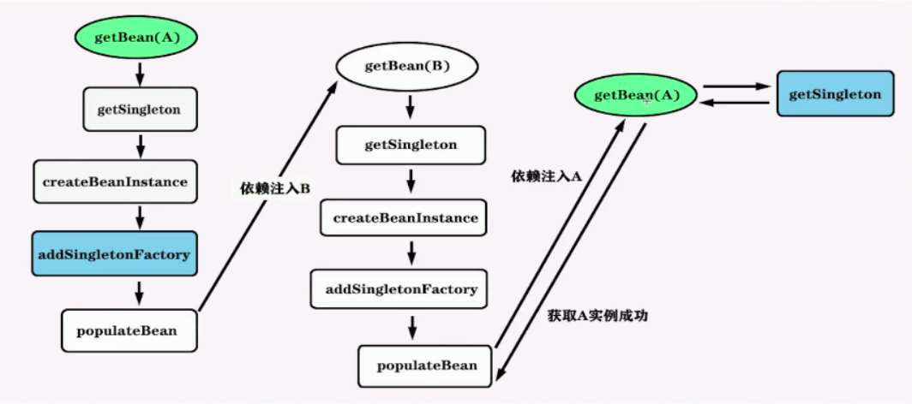
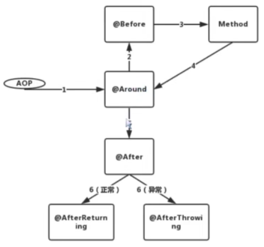
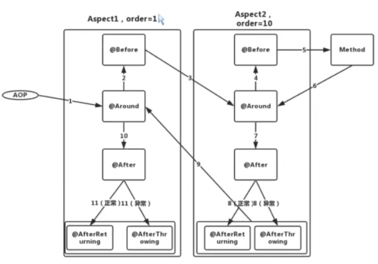

### BeanDefinitionReader
debug调试，根据调用栈追踪调用细节

断点位置：org.springframework.beans.factory.support.DefaultListableBeanFactory.registerBeanDefinition

关键词： location, Resource, ResourceLoader, BeanDefinitionReader, BeanDefinitionRegistry, DefaultListableBeanFactory


高级容器
BeanFactory vs FactoryBean

组件扫描： 自动发现应用容器中需要创建的Bean
自动装配： 自动满足Bean之间的依赖  org.springframework.beans.factory.config.AutowireCapableBeanFactory

ApplicationContext常用容器

传统的基于xml配置的经典容器
FileSystemXmlApplicationContext -- 从文件系统加载配置
ClassPathXmlApplicationContext -- 从classpath加载配置
XmlWebApplicationContext -- 用于web应用程序的容器

目前比较流行的容器--注解
以下都是在springboot项目中
AnnotationConfigServletWebServerApplicationContext 
AnnotationConfigReactiveWebServerApplicationContext  -- 响应式编程
AnnotationConfigApplicationContext


file 或 xml容器共性： refresh()
容器初始化、配置解析
BeanFactoryPostProcessor和BeanPostProcessor的注册和激活
国际化配置


容器初始化主要做的事情

配置文件读取--读取-->Resource--解析-->BeanDefinition--注册-->容器


spring可以根据地址自动选择正确的Resource
强大的加载资源的方式： 自动识别“classpath:”、“file:”等资源地址前缀
支持自动解析Ant风格带通配符的资源地址

Ant: 路径匹配表达式，用来对URI进行匹配 （正则表达式则适用范围更广）
> `?` 匹配任何单字符
> `*` 匹配0或者任意数量的字符
> `**` 匹配0个或者更多的目录

BeanDefinitionReader
利用者：
读取BeanDefinition
BeanDefinitionRegistry

经过调试：无论是xml 还是 注解方式，都会到 
org.springframework.beans.factory.support.DefaultListableBeanFactory#registerBeanDefinition 断点可以打在这个方法中


Spring 环境 & 属性由四个部分组成：PropertySource、PropertyResolver、Profile 和 Environment。

PropertySource：属性源，key-value 属性对抽象，用于配置数据。
PropertyResolver：属性解析器，用于解析属性配置
Profile：剖面，只有激活的剖面的组件/配置才会注册到 Spring 容器，类似于 Spring Boot 中的 profile 。
Environment：环境，Profile 和 PropertyResolver 的组合。

BeanFactory容器比较简单，ApplicationContext一般才会用到生产环境，ApplicationContext区别于BeanFactory：
继承 MessageSource，提供国际化的标准访问策略。
继承 ApplicationEventPublisher ，提供强大的事件机制。
扩展 ResourceLoader，可以用来加载多个 Resource，可以灵活访问不同的资源。
对 Web 应用的支持。


ApplicationContext 结构类图：
BeanFactory：Spring 管理 Bean 的顶层接口，我们可以认为他是一个简易版的 Spring 容器。ApplicationContext 继承 BeanFactory 的两个子类：HierarchicalBeanFactory 和 ListableBeanFactory。HierarchicalBeanFactory 是一个具有层级关系的 BeanFactory，拥有属性 parentBeanFactory 。ListableBeanFactory 实现了枚举方法可以列举出当前 BeanFactory 中所有的 bean 对象而不必根据 name 一个一个的获取。
ApplicationEventPublisher：用于封装事件发布功能的接口，向事件监听器（Listener）发送事件消息。
ResourceLoader：Spring 加载资源的顶层接口，用于从一个源加载资源文件。ApplicationContext 继承 ResourceLoader 的子类 ResourcePatternResolver，该接口是将 location 解析为 Resource 对象的策略接口。
MessageSource：解析 message 的策略接口，用不支撑国际化等功能。
EnvironmentCapable：用于获取 Environment 的接口。

PostProcessor的种类
大类分为容器级别的后置处理器以及Bean级别的后置处理器
BeanDefinitionRegistryPostProcessor
BeanFactoryPostProcessor
BeanPostProcessor 


事件监听器模式
回调函数：
* 往组件注册自定义的方法，以便组件在特定场景下调用

监听器将监听感兴趣的事件，一旦事件发生，便做出响应
* 事件源（Event Source）
* 事件监听器（Event Listener）
* 事件对象（Event Object）

Spring的事件监听--ApplicationEvent


Spring的事件驱动模型
事件驱动模型的三大组件
事件：ApplicationEvent抽象类 -- ApplicationEventPublisherAware,ApplicationEventPublisher,ApplicationEventMulticaster
事件监听器：ApplicationListener  -- 
事件发布器：Publisher 以及 Multicaster 

org.springframework.context.support.AbstractApplicationContext.refresh
refresh主要涉及的方法如下：
prepareRefresh--刷新前的工作准备
obtainFreshBeanFactory --获取子类刷新后的内部beanFactory实例
prepareBeanFactory--为容器注册必要的系统级别的Bean
postProcessorBeanFactory--允许容器的子类去注册postProcessor
invokeBeanFactoryPostProcessors--调用容器注册的容器级别的后置处理器
registerBeanPostProcessors--向容器注册Bean级别的后置处理器
initMessageSource--初始化国际化配置
initApplicationEventMulticaster--初始化事件发布者组件
onRefresh--在单例Bean初始化之前预留给子类初始化其他特殊bean的口子
registerListeners--向前面的时间发布组件注册事件监听者
finishBeanFactoryInitialization--设置系统级别的服务，实例化所有非懒加载的单例
finishRefresh--触发初始化完成的回调方法，并发布容器刷新完成的事件给监听者
resetCommonCaches--重置spring内核中的共用缓存


#### 依赖注入重点学习的路线
目标--理清依赖注入的思路

AbstractBeanFactory#doGetBean--获取Bean实例
DefaultSingletonBeanRegistry
```
#getSingleton--获取单实例
三级缓存--解决循环依赖
```
AbstractAutowireCapableBeanFactory
```
#createBean -- 创建Bean实例的准备
#doCreateBean  -- 创建Bean实例
#applyMergedBeanDefinitionPostProcessors -- 处理@Autowired以及@Value
#populateBean -- 给Bean实例注入属性（依赖在此注入）
```
AutowiredAnnotationBeanPostProcessor #postProcessProperties -- Autowired的依赖注入逻辑
DefaultListableBeanFactory#doResolveDependecy -- 依赖解析
DependencyDescriptor#injectionPoint -- 创建依赖实例，实现依赖注入


org.springframework.beans.factory.support.AbstractBeanFactory.doGetBean:
1.尝试从缓存获取Bean
2.循环依赖的的判断
3.递归去父容器获取Bean实例
4.从当前容器获取BeanDefinition实例
5.递归实例化显式依赖的Bean
6.根据不同的Scope采用不同的策略创建Bean实例
7.对Bean进行类检查

org.springframework.beans.factory.support.AbstractAutowireCapableBeanFactory.createBean(java.lang.String, org.springframework.beans.factory.support.RootBeanDefinition, java.lang.Object[])
>以下操作： Bean类型解析； 处理方法覆盖； Bean实例化前的后置处理；doCreateBean;

doCreateBean
>记录下呗@Autowired或者@Value标记上的方法和成员变量
>是否允许提前暴露
>填充bean属性
>initializeBean
>注册相关销毁逻辑
>返回好创建好的实例

spring循环依赖解决    
org.springframework.beans.factory.support.AbstractAutowireCapableBeanFactory.doCreateBean  
  
示例代码有如下两个类，存在循环依赖，可以在图中所示关键地方打断点： #addSingletonFactory  
com.huangxi.dao.impl.GirlFriend/com.huangxi.dao.impl.BoyFriend
>idea中 使设置断点停止条件： beanName.equals(""boyFriend")||beanName.equals(""girlFriend")

面试题： spring是否支持所有循环依赖的情况    
循环依赖情况如下：
>构造器循环依赖(singleton、prototype)
>Setter注入循环依赖(singleton、prototype)

spring不支持prototype的循环依赖
>因为没有设置三级缓存进行支持。 1.只能通过将Bean名字放入缓存里阻断无限循环；2.只支持setter注入的单例循环循环依赖
>

org.springframework.beans.factory.support.AbstractAutowireCapableBeanFactory.populateBean 方法：  

入口 org.springframework.beans.factory.support.AbstractAutowireCapableBeanFactory.doCreateBean 调用的 populateBean 方法    

>学习思路：
>1.populateBean方法调用的层级很深，不要太在意细节，只需要大致了解里面做的事情即可，
>2.在战略上要掌握脉络，带着问题再去了解细节

>方法主体部分
>1.postProcessorAfterInstantiation: 在设置属性前去修改Bean状态，也可以控制是否继续给Bean设置属性
>2.注入属性到PropertyValues中（按名字转配 or 按类型装配）
>3.postProcessorPropertyValues: 对解析完但未设置的属性进行再处理
>4.是否进行依赖检查
>5.将PropertyValues中的属性值设置到BeanWrapper中

AOP

单个AOP执行顺序   

多个aspect执行顺序


Spring AOP 实现原理
